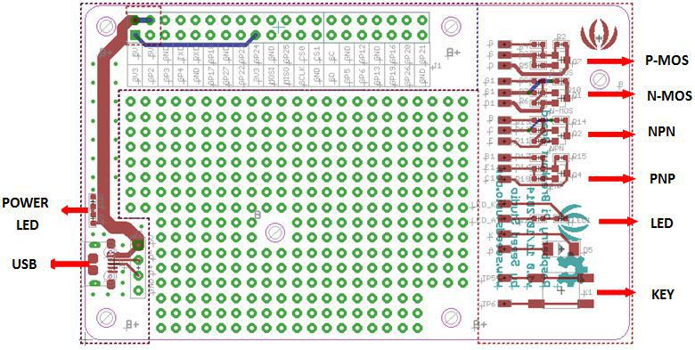
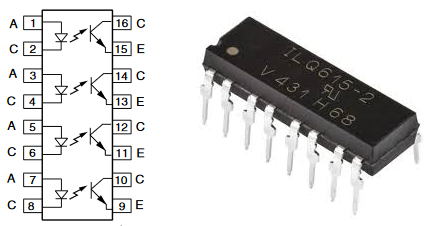

# WebShutter

WebShutter implements a simple webserver and REST API to controll GPIO pins of a Raspberry Pi. WebShutter runs as a UWP (Universal Windows Platform) on Windows 10 IOT.

## Getting started

You need a Raspberry Pi (at least model 2). Install Windows 10 IoT Core (see https://docs.microsoft.com/de-de/windows/iot-core/tutorials/tutorials).

## Hardware wiring

Our shutter hardware offers the possibility to connect push buttons for up/down commands. The connectors supply a voltage of 15V and a current of 1mA is flowing when connected. To avoid any damage to the Raspberry or shutter hardware I wanted to galvanically isolate both systems using optocouplers.

I used a [breakout board](https://www.seeedstudio.com/Raspberry-Pi-Breakout-Board-v1-0-p-2410.html) from [Seed](https://www.seeedstudio.com/), which can be screwed ontop of the Raspberry using spacers. This board offers also some additional features like an LED or a push button.

For the optocouplers I went for the ILQ615-4 which contains 4 galvanically isolated switches in a DIL 16 package:

Because each shutter requires 2 switches (and 2 GPIO pins), a Raspberry can control up to 5 shutters. But because of the limited space on the breakout board I fitted only 2 ILQ615-4 optocouplers that control 4 shutters.

Between the Raspberry GPIO pins and the optocoupler input 230&#x2126; resistors are added. This limits the current to reasonable 10mA (GPIO pin 3.3V, 1V drop on optocoupler diode => 2.3V / 10mA = 230&#x2126;)
